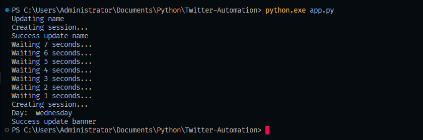

## Overview

<table>
    <tr>
        <th>Approach</th>
        <th>Description</th>
        <th>Difficulty</th>
        <th>Speed</th>
    </tr>
    </tr>
    <tr>
        <td><a href="#approach-1-obtain-twitter-api-keys-and-tokens">Obtain Twitter API Keys and Tokens</a></td>
        <td>Create a Twitter Developer account.</td>
        <td>Medium</td>
        <td>Medium</td>
    </tr>
    <tr>
        <td><a href="#approach-2-python-programming-language">Python Programming Language</a></td>
        <td>Programming language known for its readability and clear syntax.</td>
        <td>Hard</td>
        <td>Medium</td>
    </tr>
    <tr>
        <td><a href="#approach-3-python-pip">Python Pip</a></td>
        <td>Package installer for Python.</td>
        <td>Easy</td>
        <td>Fast</td>
    </tr>
    <tr>
        <td><a href="#approach-4-tweepy">Tweepy</a></td>
        <td>Python library that provides easy access to the Twitter API.</td>
        <td>Easy</td>
        <td>Fast</td>
    </tr>
</table>

## APPROACH 1. Obtain Twitter API Keys and Tokens

### Twitter Developer

Twitter Developer refers to the platform and resources provided by Twitter for developers to build applications, integrate Twitter data, and create new functionalities using Twitter's API (Application Programming Interface).

### Keys and Tokens

In the context of Twitter Developer, "Key" and "Token" usually refer to API keys and access tokens, which are essential for authentication and authorization when making requests to the Twitter API.

- **API Key (Consumer Key):**

  The API key, also known as the Consumer Key, is a unique identifier assigned to your application when you create a Twitter Developer account and register a new app. It is used to authenticate your application when making requests to the Twitter API.

- **API Secret Key (Consumer Secret):**

  The API secret key, or Consumer Secret, is a secret code that must be kept confidential. It is used along with the API key to authenticate your application.

- **Access Token:**

  Access tokens are generated after you've authenticated your application using the API key and secret key. These tokens represent the authorization granted to your application to access specific Twitter accounts or perform certain actions on behalf of a user.

- **Access Token Secret:**
  The access token secret is used in conjunction with the access token to further authenticate requests made by your application.

### How to Get?

To obtain API keys and tokens for Twitter Developer:

1. **Create a Twitter Developer Account:**

   - Go to the [Twitter Developer](https://developer.twitter.com/en/apps) portal.
   - Sign in with your Twitter account or create a new one.
   - Create a new app, providing necessary information about your application.

2. **Generate API Key and Secret:**

   - Once your app is created, navigate to the "Keys and tokens" tab.
   - You will find your API key and API secret key.

3. **Generate Access Token and Access Token Secret:**
   - Scroll down to the "Access token & access token secret" section.
   - Click on the "Create" button to generate your access token and access token secret.


## APPROACH 2. Python Programming Language

[Python](https://www.python.org/) is a high-level, general-purpose programming language known for its readability and clear syntax. Created by Guido van Rossum and first released in 1991, Python is renowned for its modular design, support for various programming paradigms, and a rich ecosystem.

### Key Features of Python:

- Clean and readable syntax.
- Interpreted and cross-platform execution.
- Support for object-oriented programming (OOP) and functional programming.
- Extensive collection of modules and standard libraries.
- Automatic memory management.
- Large and active user community.

### Installation

To use [Python](https://www.python.org/), you need to follow these steps:

#### 1. Install Python

Visit the [official Python website](https://www.python.org/) and download the latest version of Python. Follow the installation instructions for your operating system.

#### 2. Verify Installation

After installation, open a terminal or command prompt and run the following commands to verify that Python is installed:

```bash
python --version
```

**Source:**

- [Python Official Website](https://www.python.org/)

## APPROACH 3. Python Pip

[Pip](https://pypi.org/project/pip/) is the package installer for Python. It is a command-line tool that allows you to install and manage Python packages from the Python Package Index (PyPI). Pip simplifies the process of installing and managing external libraries, frameworks, and tools that enhance the functionality of your Python projects.

### Installing Pip

Pip usually comes pre-installed with Python versions 3.4 and above. If you need to install or upgrade Pip, you can use the following command:

```bash
python -m ensurepip --default-pip
```

## APPROACH 4. Tweepy

[Tweepy](https://www.tweepy.org/) is a Python library that provides easy access to the Twitter API. It simplifies the process of interacting with Twitter data, allowing developers to retrieve tweets, post tweets, search for users, and perform various other actions on the Twitter platform.

**How to Install Tweepy:**

You can install Tweepy using the `pip` package manager. Open a terminal or command prompt and run the following command:

```bash
pip install tweepy
```

example:

```python
import tweepy

# Set your Twitter API credentials
consumer_key = 'your_consumer_key'
consumer_secret = 'your_consumer_secret'
access_token = 'your_access_token'
access_token_secret = 'your_access_token_secret'

# Authenticate with the Twitter API
auth = tweepy.OAuthHandler(consumer_key, consumer_secret)
auth.set_access_token(access_token, access_token_secret)

# Create an API object
api = tweepy.API(auth)

# Retrieve tweets from the user's timeline
user_tweets = api.user_timeline(screen_name='username', count=5)

# Display the retrieved tweets
for tweet in user_tweets:
    print(f"{tweet.user.screen_name}: {tweet.text}")
```

## Bypassing Bot Detection

### I. IP hiding techniques

<table>
    <thead>
        <tr>
            <th align="center" width="2%">Technique</th>
            <th align="center" width="10%" >Speed</th>
            <th align="center" width="10%" >Cost</th>
            <th align="center" width="22%" >Scale</th>
            <th align="center" width="22%" >Anonymity</th>
            <th align="center" width="12%" >Other Risks</th>
            <th align="center" width="22%" >Additional Notes</th>
        </tr>
    </thead>
    <tbody>
        <tr>
            <td align="center"><b>VPN Service</b><br>⭐⭐<br>⭐⭐</td>
            <td>Fast, offers a balance of anonymity and speed</td>
            <td align="center">Usually paid</td>
            <td>- Good for <b>small-scale</b> operations.<br>- May not be suitable for high-volume scraping due to potential IP blacklisting.</td>
            <td>- Provides good anonymity and can bypass geo-restriction.<br>- Potential for IP blacklisting/blocks if the VPN's IP range is known to the target site.</td>
            <td>- Service reliability varies.<br>- Possible activity logs.</td>
            <td>Choose a reputable provider to avoid security risks.</td>
        </tr>
        <tr>
            <td align="center"><b>TOR Network</b><br>⭐⭐</td>
            <td>Very slow due to onion routing</td>
            <td align="center">Free</td>
            <td>- Fine for <b>small-scale</b>, impractical for time-sensitive/ high-volume scraping due to very slow speed.<br>- Consider only for research purposes, not scalable data collection.</td>
            <td>- Offers excellent privacy.<br>- Tor exit nodes can be blocked or malicious, like <a href="https://support.torproject.org/https/https-1/">potential for eavesdropping</a>.</td>
            <td align="center">-</td>
            <td align="center">Slowest choice</td>
        </tr>
        <tr>
            <td align="center"><b>Public<br>Wi-Fi</b><br>⭐</td>
            <td align="center">Vary</td>
            <td align="center">Free</td>
            <td>Fine for <b>small-scale</b>.</td>
            <td>Potential for being banned by target sites if scraping is detected.</td>
            <td align="center">Potential unsecured networks</td>
            <td align="center">Long distance way solution.<br></td>
        </tr>
        <tr>
            <td align="center"><b>Mobile Network</b><br>⭐⭐</td>
            <td>Relatively fast but slower speeds on some networks</td>
            <td>Paid, potential for additional costs.</td>
            <td>Using mobile IPs can be effective for <b>small-scale</b> scraping, impractical for large-scale.</td>
            <td>Mobile IPs can change but not an anonymous option since it's tied to your personal account.</td>
            <td align="center">-</td>
            <td align="center">Using own data</td>
        </tr>
        <tr>
            <td align="center"><b>Private/<br>Dedicated Proxies</b><br>⭐⭐⭐<br>⭐⭐<br>(Best)</td>
            <td align="center">Fast</td>
            <td align="center">Paid</td>
            <td>- Best for <b>large-scale</b> operations and professional scraping projects.</td>
            <td>Offer better performance and reliability with lower risk of blacklisting.</td>
            <td align="center">Vary in quality</td>
            <td rowspan="2">- <b>Rotating Proxies</b> are popular choices for scraping as they can offer better speed and a variety of IPs.<br>- You can use this <a href="https://addons.mozilla.org/en-US/firefox/addon/proxy-checker/">proxy checker tool</a> to assess your proxy quality</td>
        </tr>
        <tr>
            <td align="center"><b>Shared Proxies</b><br>⭐⭐⭐<br>(Free)<br>⭐⭐<br>⭐⭐<br>(Paid)</td>
            <td align="center">Slow to Moderate</td>
            <td>Usually Free or cost-effective for low-volume scraping.</td>
            <td>Good for basic, <b>small-scale</b>, or non-critical scraping tasks.</td>
            <td>Can be overloaded or blacklisted or, encountering already banned IPs.</td>
            <td>Potential unreliable/ insecure proxies, especially Free ones.</td>
        </tr>
    </tbody>
</table>

**IMPORTANT**: Nothing above is absolutely safe and secure. _Caution is never superfluous_. You will need to research more about them if you want to enhance the security of your data and privacy.

### II. Private/Dedicated Proxies (Most effective IP hiding technique)

As you can conclude from the table above, **Rotating Private/Dedicated Proxies** is the most effective IP hiding technique for **undetectable** and **large-scale** scraping. Below are 2 popular ways to effectively integrate this technique into your scraping process:

<table>
    <thead>
        <tr>
            <th align="center" width="2%">Technique</th>
            <th align="center" width="10%" >Speed</th>
            <th align="center" width="10%" >Cost</th>
            <th align="center" width="23%" >Scale</th>
            <th align="center" width="30%" >Anonymity</th>
            <th align="center" width="25%" >Additional Notes</th>
        </tr>
    </thead>
    <tbody>
        <tr>
            <td align="center"><b>Residential Rotating Proxies</b><br>⭐⭐⭐<br>⭐⭐<br>(Best)</td>
            <td align="center">Fast</td>
            <td align="center">Paid</td>
            <td>Ideal for high-end, <b>large-scale</b> scraping tasks.</td>
            <td>- Mimics real user IPs and auto-rotate IPs when using proxy gateways, making detection harder.<br>- Provides high anonymity and low risk of blacklisting/blocks due to legitimate residential IPs.</td>
            <td>Consider proxy quality, location targeting, and rotation speed.</td>
        </tr>
        <tr>
            <td align="center"><b>Datacenter Rotating Proxies</b><br>⭐⭐<br>⭐⭐</td>
            <td align="center">Faster than <b>Residential Proxies</b></td>
            <td>More affordable than <b>Residential Proxies</b></td>
            <td>Good for cost-effective, <b>large-scale</b> scraping.</td>
            <td>Less anonymous than Residential Proxies.<br>- Higher risk of being blocked.<br>- Easily detectable due to their datacenter IP ranges.</td>
            <td>Consider reputation of the provider and frequency of IP rotation.</td>
        </tr>
    </tbody>
</table>

I created twitter automation using [NodeMaven](https://nodemaven.com/?a_aid=dhohirpradana), and so far it works well and stable.


